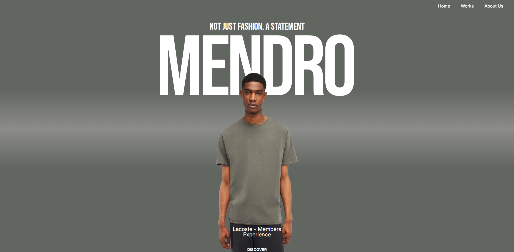

# 🌐 Landing Animada con Astro y GSAP

Una landing page creada para **practicar la integración de animaciones con GSAP en Astro** y explorar el uso de **TailwindCSS** para el diseño responsive.

---

## 🚀 Objetivo del proyecto
El propósito de este proyecto fue **practicar con Astro y GSAP**, enfocándome en:
- La integración y manejo de animaciones.
- La creación de un diseño responsive con TailwindCSS.
- La optimización de recursos en un sitio animado.

---

## 🛠️ Tecnologías utilizadas
- [Astro](https://astro.build/) – Framework de sitios estáticos.
- [GSAP](https://greensock.com/gsap/) – Librería de animaciones.
- [TailwindCSS](https://tailwindcss.com/) – Framework CSS utilitario.

---

## 📚 Lo que aprendí
- Cómo **integrar e implementar animaciones con GSAP dentro de un proyecto Astro**.
- Organización y buenas prácticas al trabajar con animaciones en componentes.
- Creación de un diseño **responsive** usando TailwindCSS.
- Optimización de recursos en proyectos con animaciones.

---

## 🧩 Retos encontrados
- Resolver **bugs con animaciones** al integrarlas en el flujo de Astro.
- Mejorar la **optimización de recursos** para mantener buena performance en la página.

---

## 🔗 Demo
El proyecto está desplegado en **Netlify**:  
👉 [Ver demo en línea](mendro.netlify.app)

---

## 🖼️ Screenshots
<!-- Agrega tus capturas de pantalla aquí -->

---

## 📌 Próximos pasos
- Agregar más animaciones con **ScrollTrigger** de GSAP.
- Explorar mejores prácticas de accesibilidad en una landing animada.
- Incluir dark mode con TailwindCSS.

